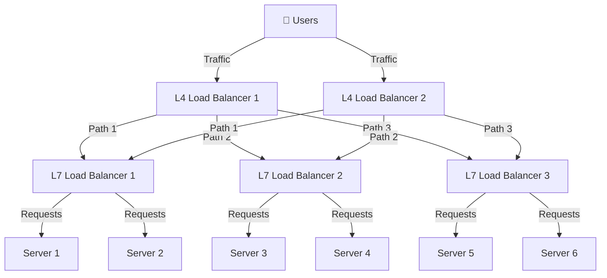

# 어떻게 도메인 주소로 부터 오는 트패픽을 여러개의 load balancer 로 부하를 분산하여 처리하는지?

1장에서 사용자 수에 따라서 요구되는 트래픽의 증가에 대비하기 위한 확장을 설명하고 있습니다. 
하지만 `Load Balancer`의 병목에 대해서는 구체적인 해결방법은 찾을 수 없었습니다.

대규모의 트래픽을 처리하는데 있어서 `Load Balancer` 역시 수평 확장이 가능한 구조로 설계가 되어야하는데 어떻게 구현할 수 있는지에 대해서 간략하게 공부한 내용을 정리해보았습니다.

## 1. DNS Round Robin

DNS에 여러개의 IP를 할당하여 트래픽을 분산시키는 방법입니다. naver, amazon, google 도메인에 대해서 IP를 조회한 결과인데 amazon과 naver는 여러개의 IP를 사용하여 서비스를 제공하는 것을 확인할 수 있습니다.
하지만 google의 경우에는 하나의 IP만을 제공하는데요. 이는 제가 참고한 레퍼런스의 결과와 다른 점이었습니다. 구글은 새로운 DNS Round Robin 방식을 더 이상 적용하지 않는 것으로 추정됩니다.

```bash
ubuntu@DESKTOP-XXXX:~$ host -t a amazon.com
amazon.com has address 205.251.242.103
amazon.com has address 54.239.28.85
amazon.com has address 52.94.236.248
ubuntu@DESKTOP-XXXX:~$ host -t a naver.com
naver.com has address 223.130.200.236
naver.com has address 223.130.192.248
naver.com has address 223.130.200.219
naver.com has address 223.130.192.247
ubuntu@DESKTOP-XXXX:~$ host -t a google.com
google.com has address 216.58.220.142
```

이 방식의 단점은 두가지가 존재합니다.
1. 클라이언트 캐시 정책에 영향을 받아서 균일한 트래픽 분산을 제공할 수 없습니다.

DNS 캐시나 다른 클라이언트 단의 캐시가 IP를 캐싱한다면 한 사용자는 동일한 IP를 할당 받은 로드벨런서를 지속적으로 호출합니다. 이는 트래픽이 완전히 분산되어 처리되는 것이 아니라 특정한 로드벨런서로 트래픽 몰릴 가능성이 있다는 것을 의미합니다.

2. 장애 발생시 서비스의 신뢰성을 훼손할 수 있습니다.

만약 하나의 로드벨런서에 장애가 발생한다면 그 로드벨런서에 할당된 IP로 접근한 사용자는 장애에 바로 노출됩니다. 이는 서비스가 항상 정상적으로 작동함을 보장하지 않는 원인입니다.

## 2. ECMP + BGP

[ECMP](https://datatracker.ietf.org/doc/html/rfc2992)는 여러개의 동일 경로 비용을 가진 경우에 경로를 선택하기 위해서 사용되는 프로토콜입니다. 해시 기반의 알고리즘을 이용해서 트래픽을 분산할 수 있습니다.
해시에 사용되는 인자는 source IP, source Port, destination IP, destination Port를 이용합니다.
해시에 사용되는 변수들는 동일한 사용자가 동일한 목적지로 접속할 수 있게 보장해줍니다. 그러나 경로의 경우 수가 변경된다면 해시 함수의 output 집합이 변경되기 때문에 다시 계산해야합니다. 이는 지속적인 연결을 제공하는데 한계가 있는 이유입니다.

라우터는 네트워크 사업자가 관리하는 부분이기 때문에 서비스 제공자가 접근할 수 없는 영역입니다. Load balancer를 추가하면 해시를 재계산해야하는 상황이 생기기 때문에 수평 확장을 할 때마다 제한이 생긴다는 단점이 존재합니다.

이를 극복하기 위해서 L7 load balancer와 L4 load balancer를 혼합하여 서비스를 구축할 수 있습니다.
다음 그래프에서는 이러한 구조를 나타냅니다. L4 계층에서는 드러오는 트래픽을 L7으로 부하 분산합니다. 여기서 사용된 해시 함수는 서비스 제공자의 영역이기 때문에 트래픽을 균일하게 유지하기 위한 해시를 설계하고 적용할 수 있습니다.
L7 계층에서는 들어온 트래픽을 요청 서버로 부하 분산하는 작업을 진행합니다.

## 3. Anycast
여러 서버가 동일한 IP 주소를 굥유할 수 있도록 하는 네트워크 주소 지정 및 라우팅 방법입니다.
Anycast를 활용하여 여러대로 구성된 load balancer를 할당하여 트래픽을 부하 분산하는데 사용할 수 있습니다.

Anycast를 활용하면 트래픽을 효과적으로 분산할 수 있지만 load balancer를 추가적으로 사용하는 이유에 대해서 찾아보았습니다.

1. 네트워크 장애가 아닌 어플리케이션의 장애에 대응이 불가능하다.
2. 정교한 트래픽 분산이 불가능하다.
   * AB test를 진행하거나 서버의 스팩 차이로 인해서 가중치를 두어 그 비율을 기반으로 트래픽을 분산하거나 하는 정교한 트래픽 분산 정책을 적용하는데 한계가 있습니다.

---
추가로 load balancer에서 고가용성을 제공하기 위한 여러가지 솔루션을 찾아보았습니다.
단순하게 어떤 역할을 하는지만 적고 나머지는 참고 문서를 봐주세요.

1. VIP, [VRRP](https://datatracker.ietf.org/doc/html/rfc5798)를 이용한 Active - standBy 구성
2. HAproxy, keepalived 오픈 소스 활용

## Reference
* [Scale Your Load Balancer Like Google - 2022.08.19](https://medium.com/codex/load-balancers-how-do-you-scale-them-79a8cb2956cc)
* [ECMP protocol by Wiki](https://ko.wikipedia.org/wiki/ECMP)
* [kako의 Anycast 활용 사례](https://tech.kakao.com/posts/307)
* [dns anycast how to improve dns performance and resilience](https://wiki.yowu.dev/ko/Knowledge-base/Network/dns-anycast-how-to-improve-dns-performance-and-resilience)
* [L4/L7 스위치의 대안, 오픈 소스 로드 밸런서 HA Proxy - 2013.02.15](https://d2.naver.com/helloworld/284659)
* [[네트워크] VRRP란? (게이드웨이 이중화 구성 - FHRP)](https://limvo.tistory.com/13)